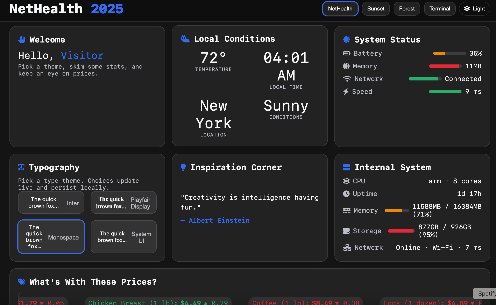
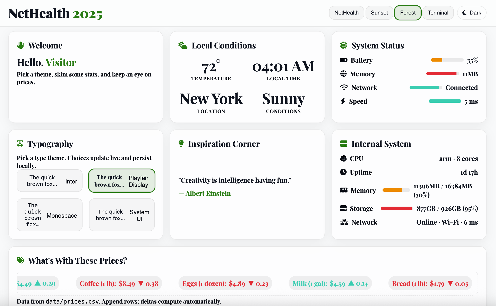
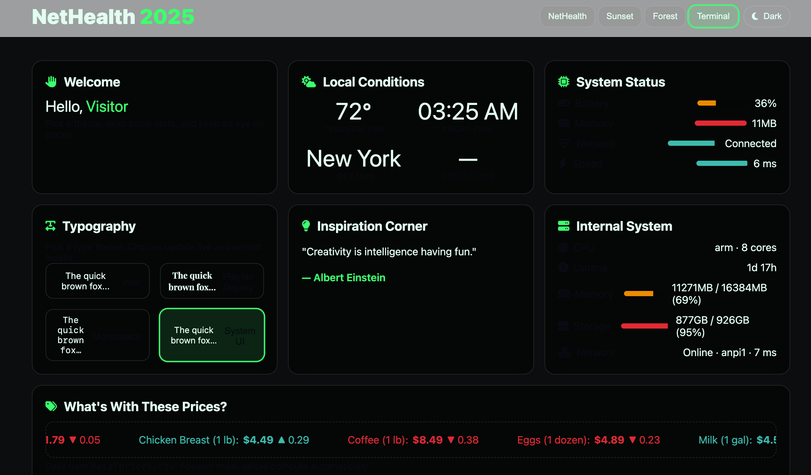

# NetHealth 2025

NetHealth 2025 is a lightweight system and environment dashboard built with **Flask**, **HTML/CSS**, and **JavaScript**.  
It's designed as a sandbox project to demonstrate real-time updates of system health, local conditions, inspirational content, network device discovery, and price tracking. All in a single responsive web dashboard.

⸻

## Features

- **Dark/Light Mode + Themes**  
  Toggle between light/dark themes and experiment with additional color schemes (NetHealth, Sunset, Forest, Terminal).

- **Typography Picker**  
  Live font preview and switching for dashboard personalization.

- **Local Conditions**  
  Displays real-time temperature, local time, and weather conditions.  
  Powered by WeatherAPI.com with automatic location detection.

- **System Health (Hybrid)**  
  - **Browser Status**: Battery, tab memory, network, and response time using browser APIs.  
  - **Server Status**: CPU, memory, storage, uptime, and network info via `/api/system` endpoint (using `psutil`).

- **Network Devices**  
  Discovers devices on your local network from ARP cache.  
  Shows IP addresses, MAC addresses, vendor names (via IEEE OUI database), and device type detection.  
  Auto-refreshes every 2 minutes.

- **Quotes (Inspiration Corner)**  
  Loads from `data/quotes.json` or falls back to built-in defaults.  
  Quotes fade smoothly, rotate randomly with refresh button, and highlight the author in the theme accent color.

- **Price Tracker**  
  Reads `data/prices.csv` and computes deltas automatically.  
  Updated rows flow into a scrolling ticker.

⸻

## Project Structure
```
NetHealth2025
├── api
│   ├── __init__.py
│   └── routes.py          # Defines all API endpoints
├── app.py                  # Flask entrypoint
├── README.md               # Project documentation
├── requirements.txt        # Python dependencies
├── data
│   ├── prices.csv          # CSV input for price ticker
│   ├── quotes.json         # JSON input for inspirational quotes
│   └── oui.txt             # IEEE OUI database for MAC address lookup
├── services
│   ├── __init__.py
│   ├── system_info.py      # Cross-platform system metrics collection
│   └── network_devices.py  # Network device discovery from ARP cache
├── static
│   ├── css
│   │   ├── main.css        # Base styles
│   │   └── themes.css      # Theme overrides + dark mode
│   ├── js
│   │   ├── dashboard.js    # Client-side dashboard logic
│   │   └── themes.js       # Theme/font handling logic
│   └── img                 # Screenshots
├── templates
│   └── index.html          # Dashboard HTML (Jinja2 template)
├── scripts
│   ├── dev_run.sh          # Helper script for local dev run
│   └── download_oui.py     # Download IEEE OUI database
└── tests
    ├── conftest.py         # Pytest configuration
    └── test_system_info.py # Unit test for system_info service
```
⸻

## Setup & Installation

1. **Clone the repo**

   ```bash
   git clone https://github.com/qrion25/nethealth2025.git
   cd nethealth2025
   ```

2. **Create a virtual environment**
   ```bash
   python3 -m venv .venv
   source .venv/bin/activate
   ```

3. **Install dependencies**
   ```bash
   pip3 install -r requirements.txt
   ```

4. **Download OUI database** (for network device vendor lookup)
   ```bash
   python3 scripts/download_oui.py
   ```

5. **Set up Weather API** (optional, but recommended)
   
   Sign up for a free account at [WeatherAPI.com](https://www.weatherapi.com/signup.aspx) and get your API key.
   
   Set environment variables:
   ```bash
   export WEATHERAPI_KEY='your_api_key_here'
   export WEATHER_LOCATION='New York City'  # Optional, defaults to auto IP detection
   ```

6. **Run the app**
   ```bash
   python app.py
   ```

   By default the app runs on port 5050.  
   Open http://127.0.0.1:5050 in your browser.

   You can specify a custom port:
   ```bash
   python3 app.py --port 5051
   ```

⸻

## Quick Start (TL;DR)

```bash
git clone https://github.com/qrion25/nethealth2025.git
cd nethealth2025
python3 -m venv .venv && source .venv/bin/activate
pip3 install -r requirements.txt
python3 scripts/download_oui.py
export WEATHERAPI_KEY='your_key'
python app.py
```

⸻

## API Endpoints
- `/api/health` → Health check (`{"ok": true}`)
- `/api/version` → App version info
- `/api/quotes` → Returns list of quotes
- `/api/prices` → Returns price list with computed deltas
- `/api/weather` → Returns current weather data from WeatherAPI.com
- `/api/system` → Returns system information (CPU, memory, storage, uptime, network)
- `/api/network/devices` → Returns discovered network devices from ARP cache

⸻

## Configuration

### Weather API (Optional)

Without a WeatherAPI key, the dashboard will show placeholder weather data.

To enable real weather:
1. Sign up at https://www.weatherapi.com/signup.aspx
2. Get your free API key (1 million calls/month)
3. Set environment variable: `export WEATHERAPI_KEY='your_key'`
4. Optionally specify location: `export WEATHER_LOCATION='Brooklyn'`

### Using a .env file (Recommended)

For persistent configuration, create a `.env` file in the project root:

```
WEATHERAPI_KEY=your_api_key_here
WEATHER_LOCATION=New York City
```

Add to your `.gitignore`:
```
.env
```

Install python-dotenv:
```bash
pip3 install python-dotenv
```

Update `app.py` at the top:
```python
from dotenv import load_dotenv
load_dotenv()
```

⸻

## Development Notes
- Static assets are served via `static/`. Add new CSS or JS here.
- Templates use Jinja2 (`templates/index.html`) and reference Flask's `url_for` for assets.
- Data files (`prices.csv`, `quotes.json`) can be edited manually to update the dashboard without restarting the app.
- Themes & Fonts are handled by `themes.css` + `themes.js`.
- System metrics use **psutil** for cross-platform support (Mac, Linux, Windows).
- Network device discovery reads from the OS ARP cache (no special permissions required).
- MAC address vendor lookup uses the IEEE OUI database (`data/oui.txt`).

⸻

## Network Device Discovery

The dashboard discovers devices on your local network by reading the system's ARP cache.

**Features:**
- Cross-platform support (macOS, Linux, Windows)
- Vendor identification via IEEE OUI database
- Device type detection (Router, Mobile Device, TV, Smart Device, etc.)
- Filters out broadcast/multicast addresses
- Auto-refreshes every 2 minutes

**Note:** You'll only see devices your computer has recently communicated with. To populate the ARP cache, access other devices on your network (e.g., ping your router, browse to a device's IP).

⸻

## Testing

Unit tests are included for the system information service.

Run tests with:

```bash
pytest -v
```

⸻

## Troubleshooting

### No network devices showing
- The ARP cache only contains devices your computer has recently communicated with
- Try pinging devices: `ping 192.168.1.1` (your router's IP)
- Wait a moment and refresh the dashboard

### Weather shows "Configure WEATHERAPI_KEY"
- Set the environment variable: `export WEATHERAPI_KEY='your_key'`
- Or add it to a `.env` file (see Configuration section)

### Weather location is incorrect
- Auto IP detection may not be accurate
- Specify your location: `export WEATHER_LOCATION='Your City'`

⸻

## Screenshots

Light & Dark Themes:
  


Additional Themes:
  
  


⸻

## Changelog
- **v0.3.0** - Added network device discovery, real weather API integration, improved vendor lookup
- **v0.2.0** - Added argparse port selection, updated quotes, and polished API

⸻

## Contact
- **Personal**: rigel.leonard@gmail.com  
- **School**: rigel.leonard31@bcmail.cuny.edu

⸻

## License
MIT License - See LICENSE.md for details

⸻

## Badges


